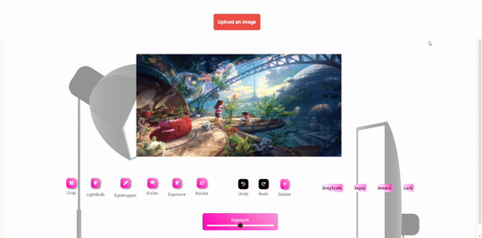

<div align="center">
  
  <h2 align="center">Quick Image Editor</h2>
   <p align="center">
    A simple web based Image editor for all your editing needs.
  </p>
  <p>
      <a href="https://gdscjgec.github.io/Image-Editor/">View Demo</a>
      |
      <a href="#">Report Bug</a>
      |
      <a href="#">Request Feature</a>
    </p>
</div>
<br />
<p align="center">Participating in</p>
<div align="center"><a href="https://hacktoberfest.digitalocean.com/"></a></div>

<!-- PROJECT LOGO -->
<br />
<div align="center">
  <p align="center"> And Organised by</p>
  <a href="https://github.com/gdscjgec">
    
  </a>
  <br />
  <a href="#"><strong>Explore the docs 🗺️</strong></a>
</div>

<!-- TABLE OF CONTENTS -->
<details open="open">
  <summary>Table of Contents</summary>
  <ol>
    <li>
      <a href="#about-the-project">About The Project</a>
      <ul>
        <li><a href="#built-with">Built With</a></li>
      </ul>
    </li>
    <li>
      <a href="#getting-started">Getting Started</a>
      <ul>
        <li><a href="#prerequisites">Prerequisites</a></li>
        <li><a href="#installation">Installation</a></li>
      </ul>
    </li>
    <li><a href="#usage">Usage</a></li>
    <li><a href="#roadmap">Roadmap</a></li>
    <li><a href="#contributing">Contributing</a></li>
    <li><a href="#license">License</a></li>
    <li><a href="#contact">Contact</a></li>
  </ol>
</details>

<!-- ABOUT THE PROJECT -->
<br />

## About The Project 📍



\
A Quick Photo Editor is an Online editing tool where you can do basic editing like cropping, contrast and exposure. 
It's easy to enhance and beautify your photos and share them on Facebook and other social media. Effects and filters bring your photos to life with easy yet impressive post-processing that takes only a few clicks.

<br />

## Built With ⛏️

- [HTML](https://html.spec.whatwg.org/multipage/)
- [CSS](hhttps://www.w3.org/Style/CSS/Overview.en.html)
- [JavaScript](https://www.javascript.com/)

And so much love ❤️
<!-- GETTING STARTED -->

<br />

## Getting Started ⚡️

To get started just fork the repository and make a clone .

### Prerequisites

You should know the basics of HTML5, CSS3 and Javascript.

- From git CLI
  ```sh
  git clone https://github.com/gdscjgec/Image-Editor.git
  ```

### Installation ⚙️

You don't need to install anything , javascript run on browser so just install any browser like chrome or Firefox if you don't have.

<!-- USAGE EXAMPLES -->

<br />

## File Structure 🧬

```
  ├── assets/
        ├──favicon        contains favicon and shortcut icons
        ├──img            contains imgs and icons.
        ├──logo           contains the logo
  ├── css/
        ├──style.css      all the default styling of index.html
  ├── js/
        ├──main.js        all the functions of index.html
  ├── index.html          Main page of the website
```


<!-- CONTRIBUTING -->
<br />

## Contributing 👍

Contributions are what make the open source community such an amazing place to learn, inspire, and create. Any contributions you make are **greatly appreciated**.

1. Fork the Project
2. Create your Feature Branch ( `git checkout -b feature/AmazingFeature` )
3. Add your Changes ( `git add .` )
4. Commit your Changes ( `git commit -m 'Add some AmazingFeature'` )
5. Push to the Branch ( `git push origin feature/AmazingFeature` )
6. Open a Pull Request

<!-- LICENSE -->
<br />

## License ⚠️

Distributed under the MIT License. See `LICENSE` for more information.

<!-- CONTACT -->

## Contact 📧

Mail us at - gdsc@jgec.ac.in